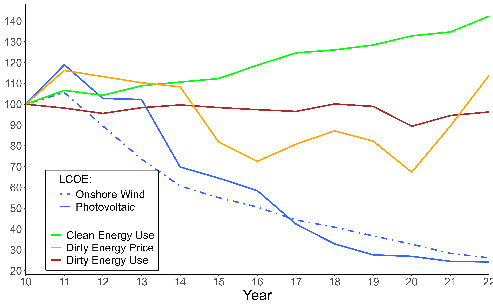

---

##### Download

+ DRAFT COMING SOON

---

##### Abstract

We propose a new methodology to estimate the aggregate elasticity of substitution between pollutant and
non-pollutant energy. Exploiting the variation in US states’ energy mixes, we find that the elasticity is closer to 1 than
previously thought. Our estimates preclude subsidies as the sole policy tool to enact the long-run energy transition. We
also propose a model that connects aggregate and sectoral elasticities, and find the average energy end-user elasticity
to be 0.72. We also conclude that aggregate elasticities do not necessarily rise with the clean energy share. Ultimately,
transportation and electricity generation are the main drags on the aggregate elasticity.
---

##### Figure 4: Energy Consumption and Relative Prices.

Notes: Plot of pollutant and non-pollutant energy consumption vs energy prices. Values normalized to 100
in 2010. LCOE estimates are from International Renewable Energy Agency (2024). All prices account for
inflation.

---

## [Citation](citation)
