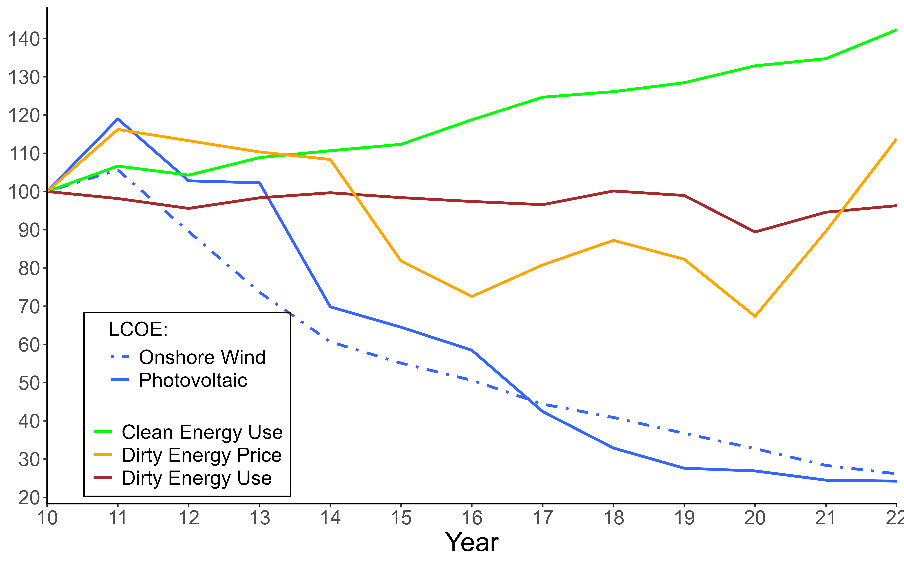

---

##### Download

+ DRAFT COMING SOON

---

##### Abstract

We develop a methodology to estimate the aggregate elasticity of substitution between pollutant and non-pollutant energy. Leveraging variation in US states' energy mixes, we estimate an elasticity of 0.6 - statistically much closer to unity than prior studies - implying subsidies alone are insufficient for a long-run energy transition. A model linking aggregate and sectoral elasticities yields an average end-user elasticity of 0.72. We show that increasing the clean energy share without raising micro-elasticities reduces aggregate elasticity. Finally, the transportation sector significantly constrains overall substitutability.

---

##### Figure 4: Energy Consumption and Relative Prices.

Notes: Plot of pollutant and non-pollutant energy consumption vs energy prices. Values normalized to 100
in 2010. LCOE estimates are from International Renewable Energy Agency (2024). All prices account for
inflation.

---

<!---
## [Citation](citation)
-->

