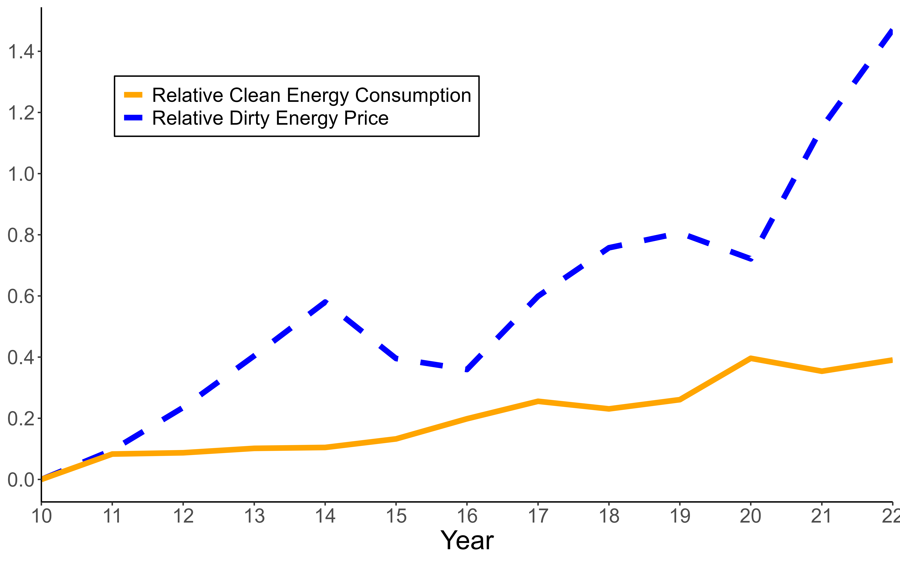

---

##### Download

+ DRAFT COMING SOON

---

##### Abstract

We develop a methodology to estimate the aggregate elasticity of substitution between pollutant and non-pollutant energy. Leveraging variation in US states' energy mixes, we estimate an elasticity of 0.6 - statistically much closer to unity than prior studies - implying subsidies alone are insufficient for a long-run energy transition. A model linking aggregate and sectoral elasticities yields an average end-user elasticity of 0.72. We show that increasing the clean energy share without raising micro-elasticities reduces aggregate elasticity. Finally, the transportation sector significantly constrains overall substitutability.

---

##### Figure 5: Clean Energy Consumption vs Dirty Energy Prices.

Notes: The figure plots two series for the U.S.: the log-difference in average energy prices between pollutant and non-pollutant sources, and the log-difference in energy consumption between clean and dirty energy. Both series are normalized to 100 in 2010 prior to the log transformation. As a proxy for clean energy prices, we use onshore wind LCOE estimates from International Renewable Energy Agency (2024); analogous results using photovoltaic estimates are shown in figure 13. All prices are adjusted for inflation.

---

<!---
## [Citation](citation)
-->

