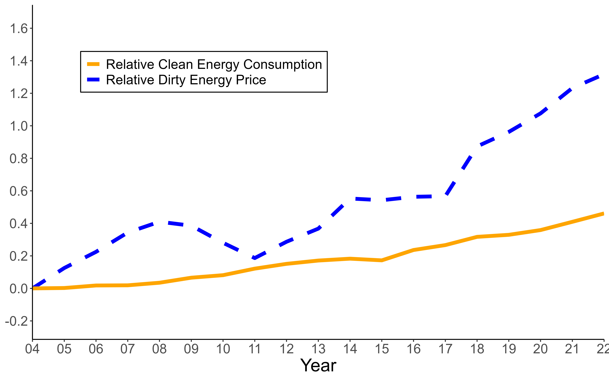

---

### MANUSCRIPT 

- [Updated Version](draft.pdf) ([Online Appendix](appendix.pdf))

- [SSRN](https://ssrn.com/abstract=5265415)

---

### Abstract

I introduce a new empirical strategy to provide the first estimate of the aggregate elasticity of substitution between polluting and non-polluting energy. Exploiting variation in US states’ energy mixes, I estimate an elasticity of 0.50 — much lower than most calibrations assume. Gross complementarity between energy sources complicates the green transition and significantly raises the economic costs of climate change. Despite rapid clean energy adoption, I find no evidence of increasing substitutability over time. A bottom-up model mapping invariant sectoral elasticities to their aggregate counterpart supports this result. These findings underscore the need for policies targeting green energy’s economic suitability.

---

##### Figure 5: Clean Energy Consumption vs Dirty Energy Prices.




Notes: The figure plots the four-year moving average for two US time-series: the log-difference between average polluting and non-polluting energy prices, and the log-difference between total clean and dirty energy consumption. Both series are normalized to 0 in 2004. As a proxy for clean energy prices, I use onshore wind LCOE estimates for new power plants in the US from International Renewable Energy Agency (2024); analogous results using photovoltaic estimates are shown in figure 12 of the supplemental appendix. All prices are adjusted for inflation.

---

### Citation

 Sousa, Rui, The Aggregate Green Elasticity of Substitution (May 22, 2025). Available at SSRN: https://ssrn.com/abstract=5265415 
 
##### Bibtex:
```BibTeX
@misc{sousa_green_2025,
  author       = {Sousa, Rui},
  title        = {The Aggregate Green Elasticity of Substitution},
  year         = {2025},
  month        = {May},
  note         = {SSRN Working Paper},
  url          = {https://ssrn.com/abstract=5265415}
}
```

---


##### Disclaimer

###### This project benefited from a PhD Scholarship from Fundação para a Ciência e a Tecnologia.

