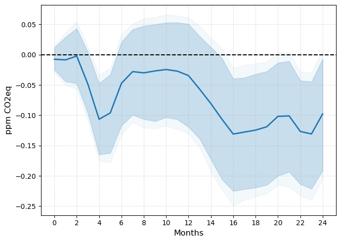

---

### MANUSCRIPT 

- [Updated Version](article_main.pdf) ([Online Appendix](article_appendix.pdf))

- [SSRN](https://ssrn.com/abstract=6934098)

---

### Abstract

I study the dynamics of greenhouse gas emissions following disruptions in crude oil markets. 
Following a 10% unexpected increase in crude oil prices, CO_2-equivalent atmospheric concentration declines by 3.24% relative to trend after two years. 
The decline is heterogeneous across greenhouse gases and reflects a reshuffling of fossil fuel use rather than a transition toward cleaner energy. 
Natural gas and petroleum products decline substantially, while lignite and bioenergy generation increase. 
Consistent with tighter financial conditions and elevated uncertainty, solar capacity also contracts following the shock. 
I find no evidence of accelerated adoption of alternative-fuel vehicles. 
Overall, the results show that an oil shock provides some of the incentives for decarbonization associated with a carbon tax, but also generates distortions that a carbon tax does not.

---

##### Figure 3, Panel (a): $CO_2$ Equivalent Concentration.




Notes: Impulse response to the oil supply news shock of Känzig (2021), normalised to a 10% increase in oil prices on impact.
h + 1 long-difference in atmospheric CO2e concentration (ppm). 
Shaded bands correspond to 90% and 95% confidence intervals based on heteroskedasticity-robust bootstrapped standard errors. 
COVID-19 (2020) is excluded from the sample. Shocks: January 2002 – December 2024; outcome data extends to December 2025.

---

### Citation

 Sousa, Rui, Cleansing Oil (June 13, 2026). Available at SSRN: https://ssrn.com/abstract=6934098
 
##### Bibtex:
```BibTeX
@misc{sousa_cleansing_2026,
  author       = {Sousa, Rui},
  title        = {Cleansing Oil},
  year         = {2026},
  month        = {June},
  note         = {SSRN Working Paper},
  url          = {https://ssrn.com/abstract=6934098}
}
```

---

##### Disclaimer

###### This project benefited from a PhD Scholarship from Fundação para a Ciência e a Tecnologia.

