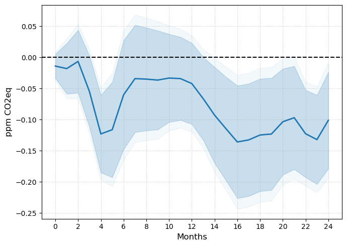

---

### MANUSCRIPT 

- [Updated Version](article_main.pdf) ([Online Appendix](article_appendix.pdf))

- [SSRN](https://ssrn.com/abstract=6934098)

---

### Abstract

I study the dynamics of greenhouse gas emissions following unexpected increases in oil prices from supply disruptions. 
I find that CO2-equivalent atmospheric concentrations decrease by 0.10 ppm relative to trend following a 10% increase in crude oil prices. 
This effect is heterogeneous across gases, reflecting a reshuffling of fossil fuel usage. 
Natural gas and petroleum products fall sharply across the board, while low-quality coal and bioenergy generation rise. 
Driven by tighter financial conditions and elevated uncertainty, solar capacity contracts. 
Hybrid and EV adoption increase markedly, partially substituting for conventional internal combustion engine vehicles.

---

##### Figure 3, Panel (a): $CO_2$ Equivalent Concentration.




Notes: Impulse responses to the oil supply news shock of Känzig (2021), normalised to a 10% increase in oil prices
on impact. Panel (a): h + 1 change in atmospheric CO2e concentration (ppm). 
Shaded bands correspond to 90% and 95% confidence intervals based on HAC standard errors. COVID-19 (2020) is
excluded from the sample. Shocks: January 2002 – December 2024; outcome data extends to December 2025.

---

### Citation

 Sousa, Rui, Cleansing Oil (June 13, 2026). Available at SSRN: https://ssrn.com/abstract=6934098
 
##### Bibtex:
```BibTeX
@misc{sousa_cleansing_2026,
  author       = {Sousa, Rui},
  title        = {Cleansing Oil},
  year         = {2026},
  month        = {June},
  note         = {SSRN Working Paper},
  url          = {https://ssrn.com/abstract=6934098}
}
```

---

##### Disclaimer

###### This project benefited from a PhD Scholarship from Fundação para a Ciência e a Tecnologia.

